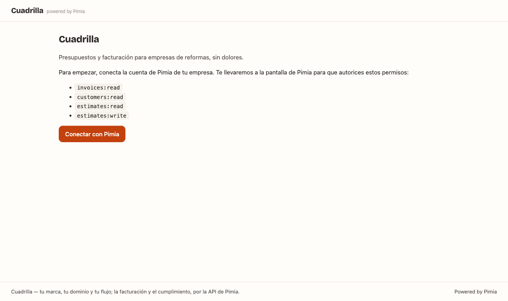
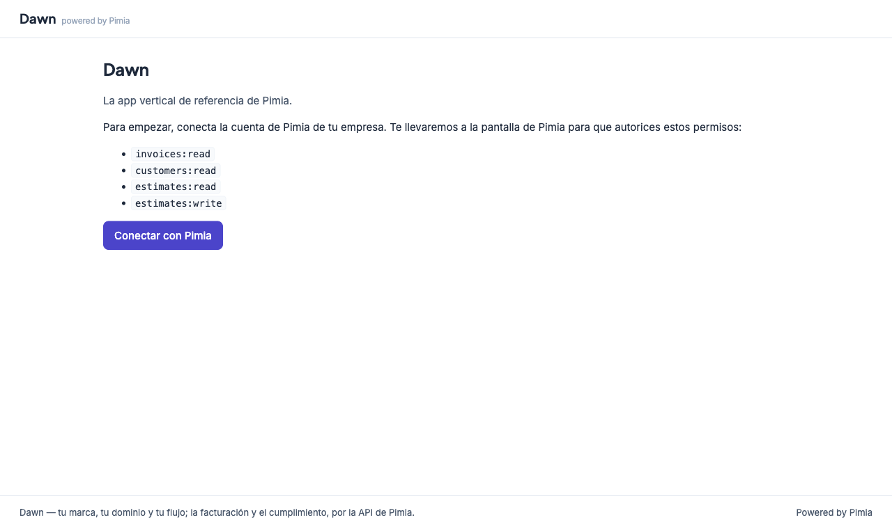

# App vertical de referencia sobre Pimia

App **completa y funcionando**: Next.js (App Router) + `@pimia/sdk`, con la
autenticación OAuth resuelta del lado del servidor y un ERP de verdad encima —
facturas, clientes y el ciclo entero de presupuestos. Es a la vez dos cosas:

- el **starter kit**: clónala, cámbiale la marca y tienes tu app vertical con
  **tu marca, tu dominio y tu flujo** sobre la facturación de Pimia;
- la **app de referencia** (el «Dawn» de Pimia): enseña, funcionando, cómo se
  hace cada cosa que cuesta acertar — la rotación del refresh, los céntimos,
  los 403 por scope, los 422 por campo, la numeración legal.

La misma app compila con **dos pieles conmutables**, y esa es la demostración
del white-label: con `NEXT_PUBLIC_THEME=partner` es «Cuadrilla», una marca
inventada de partner que no usa nada del sistema de diseño de Pimia; con
`NEXT_PUBLIC_THEME=pimia` es «Dawn», la misma app vestida con
`@pimia/design-tokens`. En ambas, el pie dice «Powered by Pimia»: la submarca
del programa de partners.

| Piel `partner` («Cuadrilla») | Piel `pimia` («Dawn») |
|---|---|
|  |  |

## Qué trae resuelto

| Pieza | Dónde | Por qué importa |
|---|---|---|
| Flujo de autorización con PKCE | `src/app/login/route.ts` | `state` anti-CSRF y `code_verifier` en cookie httpOnly de 10 minutos |
| Callback y canje | `src/app/callback/route.ts` | Valida el `state`, canjea el código y **guarda los tokens en el servidor** |
| Sesión propia | `src/lib/session.ts` | Cookie firmada (HMAC) con el tenant y un id opaco; los tokens de Pimia **nunca** llegan al navegador |
| Almacén de tokens | `src/lib/tokens.ts` | La pieza a sustituir por tu BD; documenta la regla de la rotación |
| Cliente por petición | `src/lib/pimia.ts` | `client_secret` solo en servidor; traduce «token muerto» a «re-autoriza» |
| Desconexión limpia | `src/app/logout/route.ts` | Revoca en Pimia (RFC 7009), no solo borra tu cookie |
| Pieles conmutables | `src/lib/theme.ts` + `src/app/themes/` | El white-label demostrado: marca propia vs sistema de diseño de Pimia |
| Resumen | `src/app/panel/page.tsx` | Contadores del `meta` de las listas; cero endpoints extra |
| Facturas (lista + detalle) | `src/app/panel/facturas/` | Paginación, estados, VeriFactu, líneas e impuestos; sin botón de borrar (es ley) |
| Clientes (lista + detalle) | `src/app/panel/clientes/` | Ficha fiscal + sus facturas con el filtro `customer_id` |
| Flujo vertical completo | `src/app/panel/presupuestos/` | Crear en dos campos → marcar enviado → convertir en factura borrador |
| Demo del 403 por scope | `src/app/panel/gastos/` | Página que pide un scope que la app NO tiene: enseña el error bien contado |

## Puesta en marcha

### 1. Registra tu client en el tenant

Necesitas un client **confidencial** (esta app tiene servidor, así que puede
guardar un secret). Cámbiale `TENANT` y la URL de tu app:

```bash
curl -s https://TENANT.pimia.es/oauth/register \
  -H 'Content-Type: application/json' \
  -d '{
    "client_name": "Cuadrilla",
    "redirect_uris": ["http://localhost:3000/callback"],
    "grant_types": ["authorization_code", "refresh_token"],
    "token_endpoint_auth_method": "client_secret_post",
    "scope": "invoices:read customers:read estimates:read estimates:write"
  }'
```

Guarda el `client_id` y el `client_secret` (**el secret se muestra una sola
vez**). Los scopes tienen que coincidir con `REQUESTED_SCOPES` de
`src/lib/config.ts`: pedir en el authorize algo que no concediste en el
registro es `invalid_scope`.

### 2. Configura el entorno

```bash
cp .env.example .env.local   # rellena PIMIA_* y APP_URL
openssl rand -base64 32      # para SESSION_SECRET
```

### 3. Arranca

```bash
npm install
npm run dev
```

`@pimia/sdk` y `@pimia/design-tokens` se bajan de npm como cualquier otra
dependencia, así que **puedes copiar este directorio donde quieras** — fuera
del monorepo, a tu repo — y seguirá funcionando. Si lo que quieres es tocar
el SDK y ver el efecto aquí, enlaza tu copia de trabajo:

```bash
npm install ../../typescript ../../design-tokens --no-save
```

Abre `http://localhost:3000`, pulsa **Conectar con Pimia**, autoriza en la
pantalla de Pimia y aterrizarás en el panel.

## Cómo cambiar la marca (el white-label de verdad)

La app está partida en dos capas de CSS a propósito:

- `src/app/globals.css` — la **estructura**: tablas, fichas, botones, badges.
  Escrita solo contra variables semánticas (`--ink`, `--accent`, `--ok`…).
  No hay marca aquí; normalmente no la tocas.
- `src/app/themes/*.css` — las **pieles**: cada una rellena esas variables.
  La activa la selecciona `data-theme` en `<html>` (ver `src/lib/theme.ts`).

Para poner TU marca: edita `src/app/themes/partner.css` (color, tipografía,
radios — es un fichero de 30 líneas) y tu nombre y claim en
`src/lib/theme.ts`. Las familias tipográficas se declaran con `next/font` en
`src/app/layout.tsx` (auto-hospedadas en el build: sin petición runtime a
Google, que en la UE además es terreno RGPD) y las pieles las referencian por
variable CSS. Nada más. Si además quieres otra estructura, `globals.css` es
tuyo: la API no impone ninguna UI.

### Adoptar (o quitar) la piel Pimia

La piel `pimia` es el sistema de diseño oficial como paquete **opcional**:

1. `@pimia/design-tokens` en `package.json` (aquí va por `file:`; publicado,
   será la versión de npm);
2. `import '@pimia/design-tokens/pimia.css'` en `src/app/layout.tsx` — eso
   define las variables `--pimia-*`;
3. `src/app/themes/pimia.css` mapea cada variable semántica de la app a su
   `--pimia-*`. Sin valores a mano: si el sistema de diseño cambia, la piel
   se actualiza al actualizar el paquete.

Actívala con `NEXT_PUBLIC_THEME=pimia` (variable de build: reinicia `next
dev` o recompila al cambiarla). Para quitarla del todo: borra la dependencia,
el import y el fichero de mapeo. El white-label es exactamente poder hacer
eso. Si usas Tailwind, el paquete trae también un preset
(`@pimia/design-tokens/tailwind`) con los mismos tokens.

## Los scopes que pide esta app, y por qué

`REQUESTED_SCOPES` en `src/lib/config.ts`. La regla: **el mínimo que
necesites** — el usuario los ve uno a uno en la pantalla de consentimiento, con
las escrituras marcadas aparte, y pedir de más es la forma más rápida de que no
te autorice.

| Scope | Lo usa | Para |
|---|---|---|
| `invoices:read` | Resumen, Facturas, ficha de cliente | Leer facturas y sus líneas. Solo lectura: esta app no emite |
| `customers:read` | Clientes, selector del presupuesto | Leer la cartera de clientes |
| `estimates:read` | Resumen, Presupuestos | Seguir el ciclo del presupuesto |
| `estimates:write` | Crear presupuesto, marcar enviado | El único permiso de escritura: el flujo vertical lo necesita |

Lo que **no** pide también enseña: la página **Gastos** consulta `/expenses`
sin haber pedido `expenses:read`. La API responde `403`, el SDK lo tipa como
`MissingScopeError` con el scope exacto, y la UI explica qué falta y cómo
pedirlo (añadirlo a `REQUESTED_SCOPES`, al registro del client, y volver a
conectar) — en cuanto lo hagas, esa misma página lista los gastos sin cambiar
código. Así debe morir una operación sin permiso: con instrucciones, no con un
500. El catálogo completo es
`{invoices,estimates,customers,expenses,payments,items,banking,crm,agenda}:{read,write}`
más `reports:read`.

## Las cuatro cosas que no te puedes saltar

1. **El refresh token rota.** Cada refresco devuelve uno nuevo y mata el
   anterior; reusar uno rotado hace que Pimia revoque el grant completo. El SDK
   lo persiste solo, pero **solo si tu `TokenStore` guarda de verdad** (ver
   `src/lib/tokens.ts`). Con varias instancias, añade un lock por usuario.
2. **Un token = un tenant.** No hay token global: `/login?tenant=…` muestra el
   patrón. Si sirves a varios clientes, guarda su tenant en su alta.
3. **Los importes son céntimos**, enteros. `4.500,50 €` → `450050`. Y en
   pantalla, los datos financieros van en mono tabular alineados a la derecha
   (clase `.num`): es la regla del sistema y lo que permite comparar importes
   de un vistazo.
4. **Las reglas de negocio son del servidor** y aplican igual a tu app y al
   panel de Pimia: una factura emitida no se borra (se rectifica), la cadena
   VeriFactu es inmutable, la numeración es correlativa y la pone Pimia, y los
   `422` traen los errores por campo. No intentes replicar esa lógica en tu
   app: consúmela.

## De aquí a producción

- **Sustituye `FileTokenStore` por tu base de datos.** Es lo único imprescindible.
- Sustituye la sesión de `src/lib/session.ts` por la que ya use tu app.
- Cambia la `redirect_uri` registrada a tu dominio de producción y usa
  cookies `Secure` (automático si `APP_URL` es `https://`).
- Trata `UnauthorizedError` como «pide autorización otra vez», no como error
  recuperable: significa que el usuario te revocó o el grant murió.
- Cuando `@pimia/sdk` y `@pimia/design-tokens` estén publicados en npm, cambia
  las dependencias `file:` por versiones y borra `outputFileTracingRoot` de
  `next.config.mjs`.

## Qué le falta (a propósito)

Esto es una referencia, no un producto: no hay i18n (todo en español), ni piel
oscura, ni pagos/artículos/banca (sus scopes existen: `payments:*`, `items:*`,
`banking:*`; gastos está solo como demo del 403), ni webhooks (llegarán como
pieza aparte de la plataforma). Cada uno de esos huecos es deliberadamente
pequeño de rellenar con los mismos patrones que ya ves aquí.
